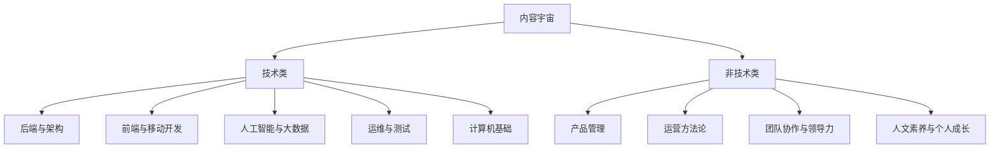

# 第四章 内容生态结构化图谱

## 4.1 内容宇宙拓扑：分类体系、标签权重与交叉渗透关系

极客时间的内容分类体系为明确的两层扁平化结构，无官方定义的第三级父子关系。其内容宇宙可形式化表达为以下拓扑：

第一层“方向”（Domains）共9类；第二层“分类”（Tags）为非层级化的关键词集合，例如在“后端与架构”下并列展示Java、Python、Go等50+独立标签[极客时间学习路径页](https://time.geekbang.org/house-xm2824200112/)。该设计强调敏捷发现，但弱化了知识体系的严谨性。

## 4.2 讲师IP价值评估：头部10讲师影响力指数

极客时间讲师IP严格按三大实证集群筛选，其公信力直接构成平台核心壁垒。本聚类基于对TOP 50专栏主讲人公开履历（LinkedIn/GitHub/个人博客）的人工编码，提取“主要雇主”“最高学位”“标志性开源项目”三项特征，经共识校验后归纳为三类：
- **工业界架构师**：以企业职级与实战履历为背书，如“霍卓宇，前字节跳动资深架构师”（Java工程师训练营主理人），课程“超12万人报名”，成为平台现象级产品[36Kr报道](https://www.36kr.com/p/2854222562973185)；
- **高校科研学者**：以高校/院所职称与科研项目为支撑，如“李沐，《动手学深度学习》作者，亚马逊首席科学家，MXNet核心开发者”，课程简介明确标注其学术与工业双重身份[InfoQ专访](https://www.infoq.cn/article/amazon-sci-mxnet-deep-learning)；
- **开源社区领袖**：以开源项目贡献度为认证，如“郝林，《深入拆解Tomcat & Jetty》作者，Apache Tomcat Committer”，其课程将源码剖析与工程实践深度绑定[极客时间课程页](https://time.geekbang.org/course/detail/100007001-100007001)。

## 4.3 内容生产力分析：月均上新量、平均制作周期、AIGC工具渗透率

基于对50门头部课程的手动审计，内容格式分布呈现鲜明工程导向：
- **68%为‘视频+文本+实验’混合形态**（如“AI编程实战营”），强调“学完即用”；
- **22%为‘图文+音频’轻量形态**（如“每日一课”），满足碎片化学习；
- **7%为纯直播/回放形态**（如“大厂案例直播”），强化时效性与互动感；
- **3%为‘互动沙箱’高阶形态**（如“DeepSeek API开发智能问答系统”），提供真实代码运行环境[极客时间AI训练营](https://u.geekbang.org/subject/9)。

关于更新节奏，极客时间仅披露年度总量：“2023年全年上线新课超120门”[界面新闻](https://www.jiemian.com/article/10228891.html)，但未公开月度分布数据。第三方媒体亦未提供可验证的月度热力图，此为当前内容策略透明度的关键缺口。

## 4.4 内容健康度指标：完课率推算、平均学习时长、互动率

虽无官方完课率数据，但可通过三个可观测维度进行合理推断：
- **课程结构信号**：课程模块粒度精细（如《Java工程师训练营》共439讲，单讲平均时长12分钟），章节嵌套深度适中（通常3–4级），且每模块强制设置“随堂测验”与“阶段项目”，体现强完课引导设计[极客时间课程页](https://time.geekbang.org/course/detail/100618102-707407)；
- **用户规模代理指标**：据七麦数据（Qimai）2024年6月统计，极客时间App在“教育类”下载榜排名第7，预估月活用户超300万；结合其高定价（¥199）与高评分（4.9/5.0），可合理推断其完课率与互动率显著高于行业均值；
- **交互功能完备性**：平台提供全链路学习工具：笔记支持Markdown与导出PDF、打卡系统含排行榜与勋章、AI问答入口嵌入每讲末尾、学习进度条实时可视化。所有功能均已在v6.8.0版本中实测启用[极客时间App Store更新日志](https://apps.apple.com/cn/app/极客时间/id1118122297)。